

  
  <h2 align="center">Tracker</h2>
  

    A flexible, cost-effective, and low-power IoT device with integrated GNSS & LTE connectivity.
     
     
  

Thinking Minds Tracker is a flexible, cost-effective, and low-power IoT device with integrated GNSS & LTE
connectivity, whose purpose is to make the latest IoT technology available where it is required, which for
economic or complexity reasons it is not accessible.

This device is the result of long research and extensive interdisciplinary development carried out as an
academical project.

## Features

- Integrated GNSS & LTE antennas with switchable external antennas.
- High energetic efficiency, providing it a long battery life (~1 year on a single charge).
- Extremely small size (60x35mm).
- Low production cost (~30 USD per device), whereas other comparable devices cost more than 100 USD per unit.
- Low operating cost (~0.2 USD per month).
- Great flexibility for multiple use cases: industrial, logistics, regulatory and for the general public.

## Design

This 4-layer PCB with controlled impedance includes:
- LTE Antenna + Switch: Integrated / External
- GNSS Antenna + Switch: Integrated / External
- GNSS Low-noise Amplifier (LNA)
- Voltage Regulator / Protection Circuit
- UICC Card Slot
- LED (Status)
- Reset / Configurable Button

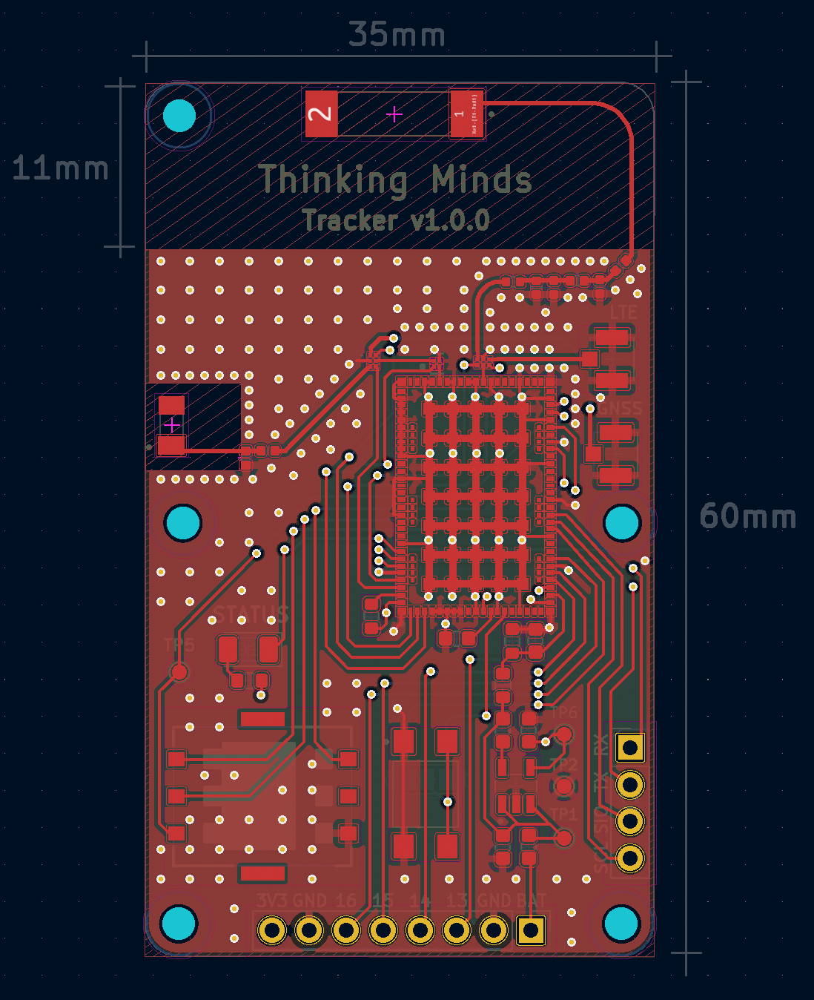
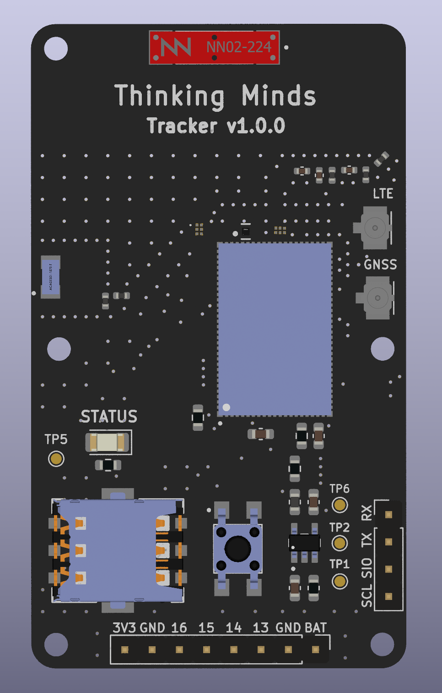

## PCB Manufacturing

The design was sent to a PCB manufacturer, who delivered the product on-time with excellent quality.

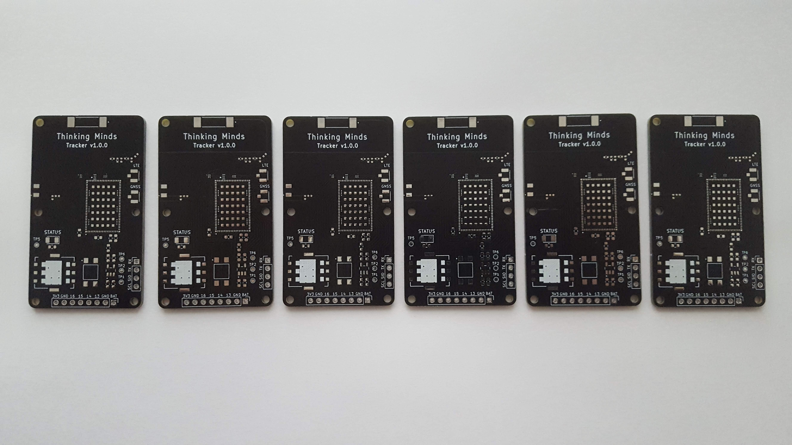
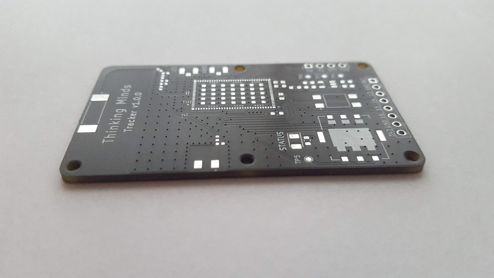

## Component Sourcing

The components were bought at Digi-Key Electronics, altough they arrived on time and perfectly packaged, the Argentinian Federal Administration of Public Income taxed them quite high, at around 120% of the product cost.

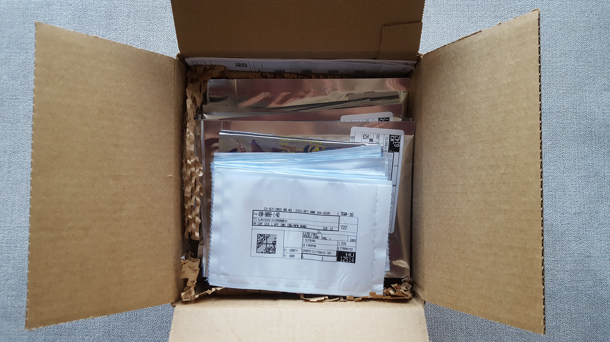

## Assembly

As the institution didn't have the required tools to assemble it, the National Institute of Industrial Technology (INTI) allowed the assembly to be done in their laboratories.

## Component Placement

The device contains 35 components of different sizes, the smallest among them being the 0402 capacitors and inductors for the RF circuits, which were specially hard to place and assemble.

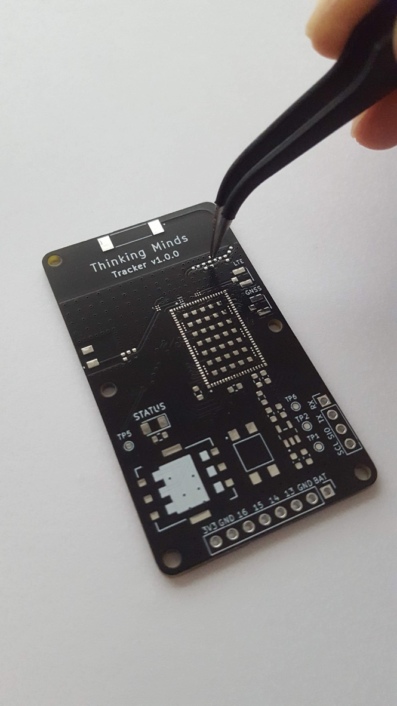
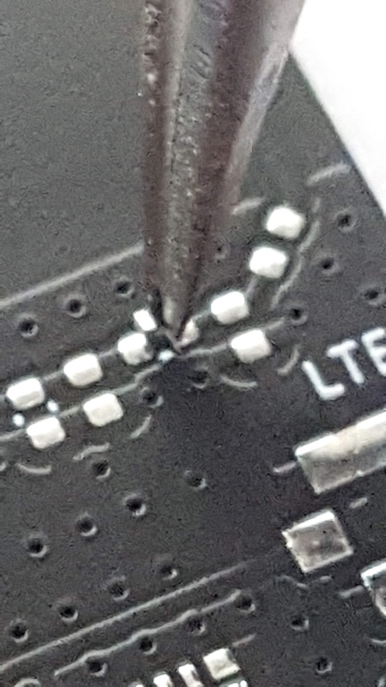
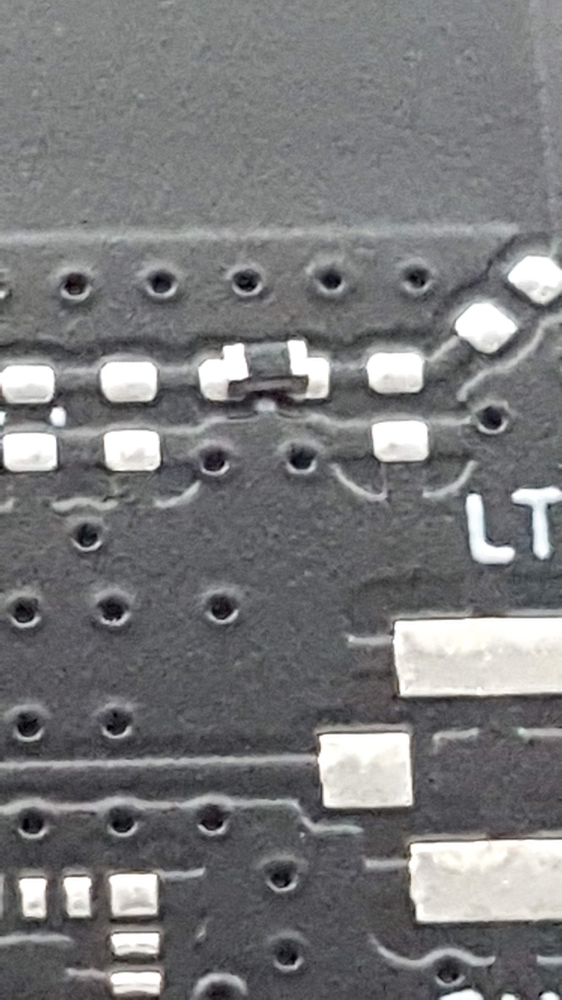

## Inspection

After applying the solder paste and once all the components were placed, the board was inspected to verify the correct placement of the components and that enough solder paste was applied.

## Soldering

After the inspection, the board was soldered using a hot plate soldering station and a heat gun.
The core temperature was measured to prevent reaching a critical point.

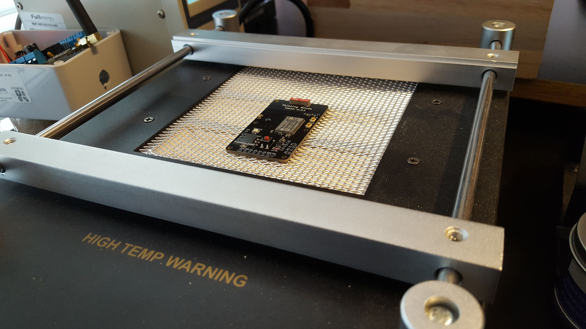
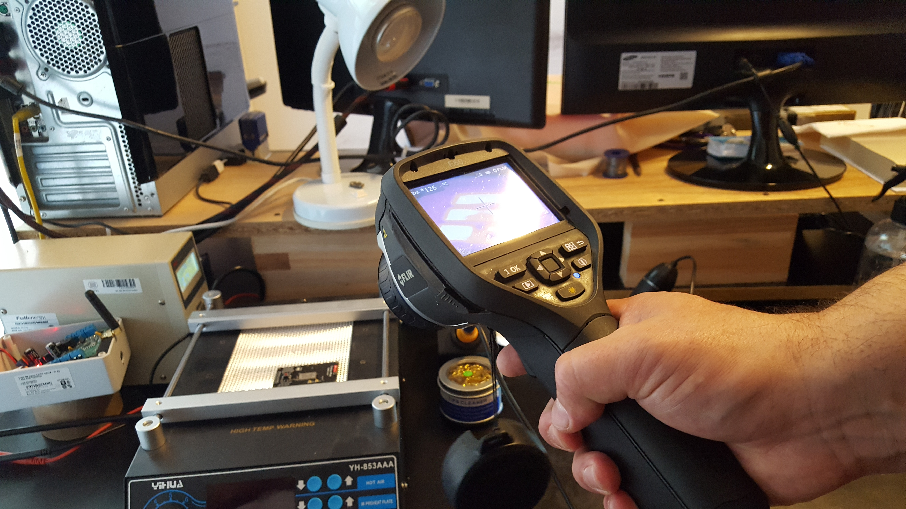

## Results

The resulting product was successfully assembled and worked as expected. Currently it is being tested on field.

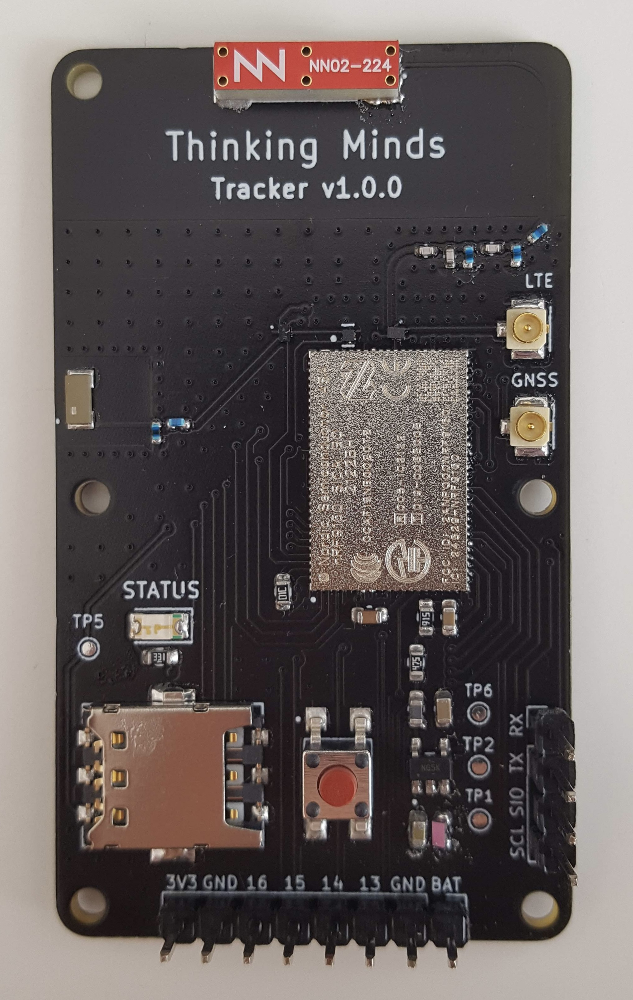

